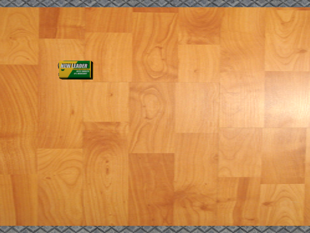
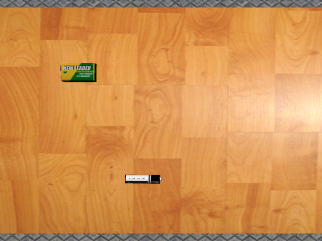
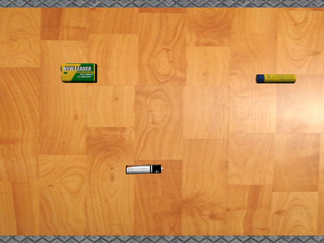
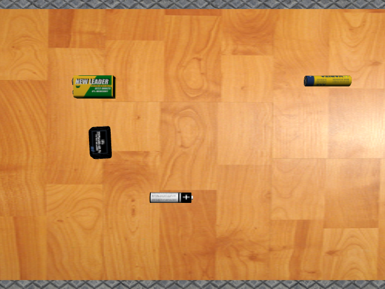
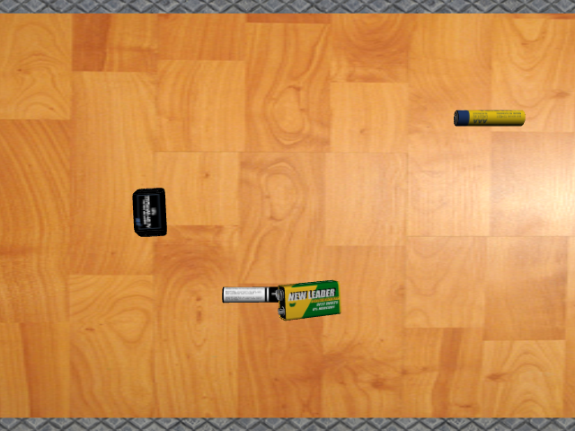

# ROS2 Evaluation Task - Battery Model Spawner with Camera Integration

[](https://docs.ros.org/en/humble/)
[](http://gazebosim.org/)
[](https://github.com/AhmedMorsy1024/ros2-evaluation-task)

## 📋 Overview

This repository contains a  ROS2 package for an **automated battery model spawning system** with integrated camera perception.

### 🎯 Key Features

- ✅ **Automated Model Spawning**: Cyclically spawns 4 different battery models at random positions
- ✅ **Smart Model Management**: Automatically deletes previous instances of the same model before spawning new ones  
- ✅ **Camera Integration**: Real-time camera feed subscription and image capture
- ✅ **Reusable Components**: Modular `GazeboUtilsClient` library for Gazebo operations

### 🚀 Quick Demo Access

> **Want to see it in action?** Jump directly to:
> - 📹 [**Demo Videos**](#-demo-videos) - Watch the system in action
> - 📸 [**Image Gallery**](#-captured-images-gallery) - See captured results
> - 🏃 [**Quick Start**](#-quick-start-guide) - Get up and running

## 🎥 Live Demonstration

### System in Action

<div align="center">

#### 🎬 Demo Videos

| Demo | Description | Video |
|------|-------------|-------|
| **Basic Model Spawning** | Shows automated spawning and deletion of battery models | [📹 View Video](demos/spawn_delete.mkv) |
| **Camera Integration** | Complete system with image capture functionality | [📹 View Video](demos/spawn_delete_after_adding_image_saving.mkv) |

</div>

> **💡 Note**: Click on the video links above to view or download the demonstration videos directly from the repository. The videos show the complete system functionality including model spawning, deletion, and camera integration.

#### 🎥 Alternative Video Viewing

If the above links don't play directly in your browser, you can also try these direct video embeds:

<details>
<summary><b>📹 Basic Model Spawning Video</b></summary>
<br>

```html
<video width="800" controls>
  <source src="demos/spawn_delete.mkv" type="video/x-matroska">
  Your browser does not support the video tag. <a href="demos/spawn_delete.mkv">Download the video</a>
</video>
```

</details>

<details>
<summary><b>📹 Camera Integration Video</b></summary>
<br>

```html
<video width="800" controls>
  <source src="demos/spawn_delete_after_adding_image_saving.mkv" type="video/x-matroska">
  Your browser does not support the video tag. <a href="demos/spawn_delete_after_adding_image_saving.mkv">Download the video</a>
</video>
```

</details>

### 📸 Captured Images Gallery

The system automatically captures high-quality images after each model spawn:

<div align="center">
  <table>
    <tr>
      <td align="center">
        
      </td>
      <td align="center">
        
      </td>
      <td align="center">
        
      </td>
      <td align="center">
        
      </td>
      <td align="center">
        
      </td>
    </tr>
  </table>
</div>

*🤖 **Real captured images** showing different battery models spawned at random positions in the simulation*

## 🚀 Quick Start Guide

### Prerequisites

- **Ubuntu 22.04 LTS** (Recommended)
- **ROS 2 Humble Hawksbill**
- **Gazebo Classic 11**
- **OpenCV 4.x**

### 1️⃣ Clone & Setup

```bash
# Clone the repository
git clone https://github.com/AhmedMorsy1024/ros2-evaluation-task.git
cd ros2-evaluation-task

# Move to your ROS2 workspace
mkdir -p ~/ros2_ws/src
cp -r src/ros2_eval_task ~/ros2_ws/src/
cd ~/ros2_ws
```

### 2️⃣ Install Dependencies

```bash
# Update package list
sudo apt update

# Install ROS2 dependencies
sudo apt install \
  ros-humble-gazebo-ros-pkgs \
  ros-humble-gazebo-plugins \
  ros-humble-vision-msgs \
  ros-humble-cv-bridge \
  ros-humble-visualization-msgs \
  ros-humble-rviz2 \
  libopencv-dev
```

### 3️⃣ Build & Source

```bash
# Build the workspace
colcon build --symlink-install 

# Source the workspace
source install/setup.bash
```

### 4️⃣ Launch System

```bash
# 🎯 Complete System (Recommended)
ros2 launch ros2_eval_task gazebo_with_spawner.launch.py

# 🔧 Basic Environment Only
ros2 launch ros2_eval_task gazebo.launch.py
```


### Core Components

| Component | Language | Responsibility |
|-----------|----------|----------------|
| **GazeboUtilsClient** | C++ | Gazebo service calls (spawn/delete) |
| **ModelSpawnerNode** | C++ | Main orchestration and camera handling |
| **Launch System** | Python | System startup and configuration |
| **Model Library** | SDF/DAE | 3D battery models with textures |

## 📂 Project Structure

```
ros2_eval_task/
├── 📁 src/
│   ├── gazebo_utils_client.cpp      # Utility library implementation
│   └── model_spawner_node.cpp       # Main node with camera integration
├── 📁 include/
│   └── gazebo_utils_client.hpp       # Library header definitions
├── 📁 launch/
│   ├── gazebo.launch.py             # Basic Gazebo environment
│   └── gazebo_with_spawner.launch.py # Complete system launch
├── 📁 models/                          # 3D battery models (SDF + meshes)
│   ├── battery_9v_leader/
│   ├── battery_energizer/
│   ├── battery_varita/
│   └── lipo_battery/
├── 📁 worlds/
│   └── factory.world                # Gazebo simulation environment
├── 📁 rviz/
│   └── default.rviz                 # Visualization configuration
└── 📁 demos/                           # Demonstration videos & images
    ├── spawn_delete.mkv
    ├── spawn_delete_after_adding_image_saving.mkv
    └── image_*.png
```

## ⚙️ Configuration & Parameters

### Spawning Configuration
```yaml
spawn_interval: 5.0 seconds          # Time between spawns
image_capture_delay: 500 milliseconds # Delay after spawn before capture
service_timeout: 5.0 seconds         # Gazebo service call timeout
```

### Position Parameters
```yaml
spawn_area:
  x_range: [-0.21, 0.21] meters      # Left-right spread
  y_range: [-0.43, 0.43] meters      # Front-back spread  
  z_height: 1.1 meters               # Fixed drop height
```

### ROS Topics & Services
| Name | Type | Purpose |
|------|------|---------|
| `/camera/image_raw` | sensor_msgs/Image | Camera feed input |
| `/spawn_entity` | gazebo_msgs/srv/SpawnEntity | Model creation |
| `/delete_entity` | gazebo_msgs/srv/DeleteEntity | Model removal |

## 📸 Image Capture System

The automated image capture system:

1. **Monitors spawn events** - Listens for successful model spawning
2. **Smart timing** - Waits 500ms for model to settle and be visible
3. **Single frame capture** - Captures exactly one image per spawn
4. **Automatic saving** - Saves as `captured_images/image_<ID>.png`
5. **Sequential naming** - Auto-increments counter for unique filenames